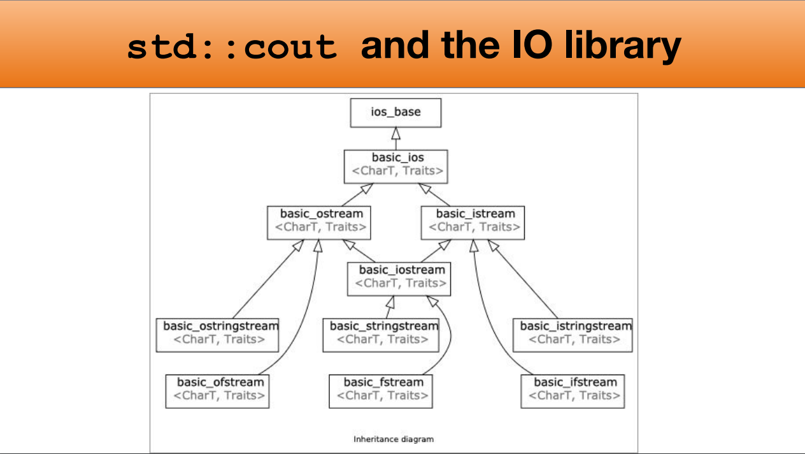
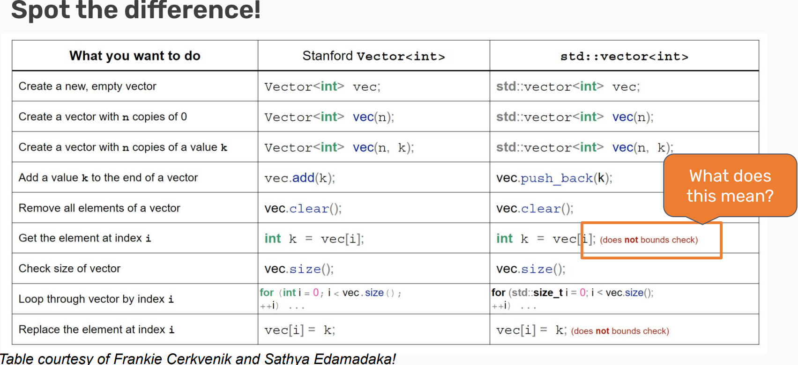
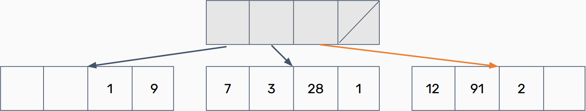
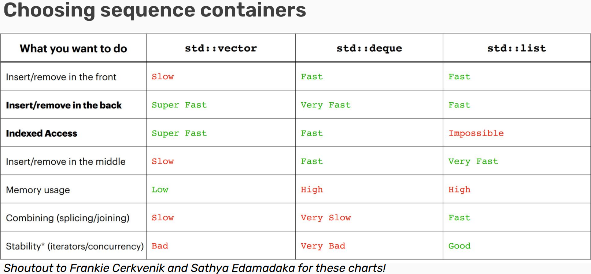
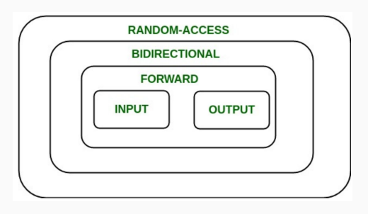
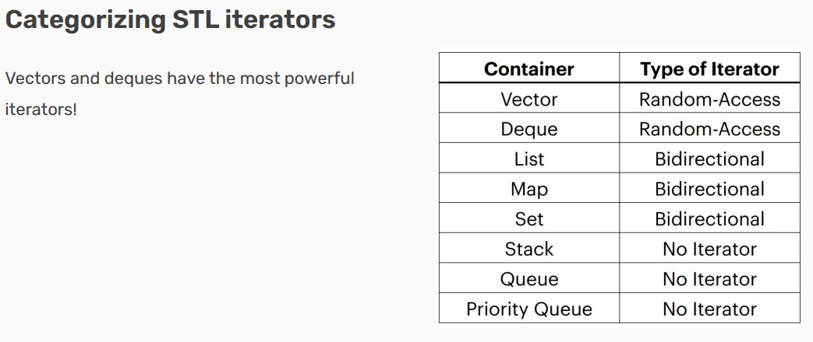
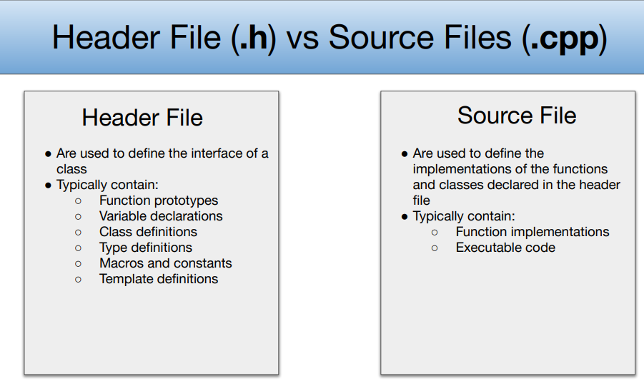

Namespaces:
- ! `using namespace std;`, which automatically add std:: for you, but it's not good style.

Function overloading

使用方法重载，只需要如下
- same function name
- different typed arguments and different number of arguments

例如

```c
int half(int x)
{
    std::cout << "1" << endl;
    return x / 2;
}

double half(double x)
{
    cout << "2" << endl;
    return x / 2;
}

```
### problem 1:
- it can be a pain to konw what the type of a variable is.

自动类型推导, `auto` 关键字, 编译器决定类型

```c
auto a = 3; // int
auto b = 4.3; // float
auto c = 'x'; // char
auto d = "hello"; // char *


```

### problem 2:
- any given fuction can only have exactly one return type

使用结构体，就可以传递，返回多个信息

```c
struct Student
{
    string name;
    string state;
    int age;

};

```
STL structs
- std:: pair:, 这是一个模板 template

```cpp
std::pair<int, string> numSuffix = {1, "st"};

```

> `std::make_pair` 是 C++ 标准库中的一个函数模板，用于快速创建一个 `std::pair` 对象，而不需要显式指定其中元素的类型。`std::pair` 是一个结构，它可以存储两个可能不同类型的值。这个函数模板在 `<utility>` 头文件中定义。

一个简洁的例子，使用 `std::pair` 进行返回
```cpp
std::pair<bool, Student> lookupStudent(string name)
{
    Student blank;
    if (notFound(name)) return std::make_pair(false, blank);
    Student result = getStudent(name);
    return std::make_pair(true, result);
}

auto ouput = lookupStudent("Julie");
```
## Lecture 3: Initialization & Reference
初始化操作
> Provides initial values at the time of construction - cppreference.com

C++ it doesn't type check with direct initialization.

引起缩小转换范围，narrowing conversion, 例如
```cpp
int criticalSystemValue(42.5);
```

编译器给出了提示
```bash
 $ clang++ ./narrow_convert.cpp -o narrow_convert     
./narrow_convert.cpp:5:29: warning: implicit conversion from 'double' to 'int' changes value from 42.5 to 42 [-Wliteral-conversion]
    5 |     int criticalSystemValue(42.5);
      |         ~~~~~~~~~~~~~~~~~~~ ^~~~
1 warning generated.
[  1:16PM ]  [ c0r3dump@ArchLinux:~/Workspace/CS106L/code(master✗) ]
 $ ./narrow_convert 
critical system value: 42

```
<font color="red"> Uniform initalization (C++11)</font>

使用大括号进行初始化

```cpp
int numOne{12.0};
```
- 安全，不允许 narrowing conversion: `./narrow_convert.cpp: 6:16: error: type 'double' cannot be narrowed to 'int' in initializer list [-Wc++11-narrowing]
    6 |     int numOne{12.5};
      |                ^~~~`
- 使用在多个地方，vector, maps, 等等
```cpp
std::map<std::string, int> ages
{
    {"Alice", 25},
    {"Bob", 30}
};

// 结构体初始化
Student s{"Haven", "AR", 21};

```

Structured Binding (C++17)
- 强大，可以组合多个子元素
```cpp
std:string className = "a";
std:string language = "C++";

return {className, language};


```

引用类型，可以提高性能，按引用传递 Pass by reference, there is no copy.

```cpp
int num = 5;
int& ref = num;

```

l-value, r-value
- r-value is temporary, x = 100, 100 is r-value

如果变量是 `const`, 那么引用也要是 `const`

使用 g++进行编译
`g++ -std=c++11 main.cpp -o main`

## Streams

I/O 输入输出流
- 读写数据



std:: stringstream

- 一种将 string 作为 strams 的方式

- `>>` 会一直读取，知道遇见空字符
  - "", \n, \t 都是空字符
  - 使用 `getline()` 可以一直读取，直到 `\n`

```cpp
#include <iostream>
#include <string>
#include <sstream>

int main()
{
    std::string initial_quote = "Bjarne Stroustrup C makes it easy to shoot yourself in the foot.";

    std::stringstream ss(initial_quote);

    std::string first;
    std::string second;
    std::string third;
    std::string extracted_quote;

    ss >> first >> second >> third;
    std::getline(ss, extracted_quote);
    std::cout << first << " " << second << " " << third << extracted_quote << std::endl;
}

```

std:: count 是 line-buffered, 知道 flush 时候才会输出

- 所以 `cout << i++`: 12345
- cout << i++ << endl; 1\n2\n3\n\4\n5\n


cerr and clong

- cerr 输出 error, unbufferd
- clog: 日志输出， bufferd


Output File Streams

std:: ofsteam 

- is_open()
- open()
- clonse()
- fail()

std:: cin 是 bufferd 的，

使用 `getline`

## Containers

容器

vectors, stacks, queues

重排列相关的数据

标准化

- 允许存储多个对象，相同类型
- 允许访问对象

- 允许，读写对象

STL 有许多的容器

- Vector
- Stack
- Queue
- Set
- Map

...

- Array, 固定大小的 vector
- Deque，双端 queue
- List， doubly linked list
- Unordered set
- Unordered map



在 speed, power, 以及 safety 之间的取舍

C++设计哲学

- 只提供必要的检查
- 开发者应该知道一切

有两种类型的容器

Sequence

- 可顺序访问的容器

Associative 关联类型

- 容器不必有顺序
- 查找方便
- 例如 Maps 和 sets


Vector

- 一种有序的集合，并可以扩充和收缩

Internally, vectors implement an array

- _size, 元素个数
- _capacity, 实际分配的空间

Deque

一种实现方式

a array stored other arrays

- 减少，数组插入和删除时的移动开销





Map

std:: pair <const key, value>


Container Adaptors

是对容器的包装，增加/限制了原有容器的接口的访问

例如，stack_deque 是对 deque 的包装

stack_list 是对 list 的包装

- 可以更加满足某些场景需求
- 可以根据用途选择不同的容器类型

练习

- unordered sets/maps 对比 ordered
- 考虑如何使用 vector 实现 stack
- 浏览 C++官方文档


C++23

flat_map

flat_set,  更快的容器

容器包含了许多对象

如何访问这些对象


Iterators,迭代器

容器实现了Iterators来做这些事情

- 访问所有数据
- 知道顺序，next

In the STL

所有的容器实现了iterators，但不是都相同

一些相同的操作

- 初始化 iter=s.begin()
  - begin() end()方法
- ++iter, 
- *iter,解引用

不同的iterator




input

例如：`auto elem = *it;`

output

`*elem = value`

bidrectional

--iter

random

iter+=5




简单的遍历方法

```cpp
for (auto iter=set.begin(); iter!=set.end(); ++iter)
    const auto& elem = *iter;
```

for-each loop

## 指针Pointers

```cpp
int val = 18;
int* ptr = &val;

```

如果想要访问数据，解引用

```cpp
std::cout << *ptr << std::endl;
```

- Iterators are a type of pointer
- 迭代器只能指向容器中的元素，但是指针可以指向任何对象
  - 都只不过是内存罢了

## Classes 类

C语言缺乏OOP机制，

- 类允许用户封装数据和功能

### OOP

- 一切围绕对象展开
- 关注类设计与实现
- 类对象

容器就是一些定义在STL中的类

有趣的点

struct和class的对比

- struct没有访问控制，class有

```c
struct Student
{
    // fields
    std::string name;
    std::string state;
    int age;
    
};
// 所有的field是public,可以被用户进行修改
// 导致一些未定义行为，如下
s.age = -2345;
// 修改为负数

```

类

public, private

限制对private域的访问


a Student class





class 设计

- constructor
- private member function/variables
- publice member fuction / 接口 for a user
- Destructor


构造函数

- 对象初始化

`this`关键字，指向当前对象

类型重定义

```cpp
using String = std::string;
// 此时String类型就代表了std::string

```


类继承

- 多态，不同的对象，需要相同的接口

- 可扩展

比如

```cpp
// shape class
// has area() 
// but different 方法去计算面积
```


容器适配器（stack ...）和子类的对比

子类：主要用于继承和扩展现有类的功能，通过重用父类的代码实现多态性和代码复用。
容器适配器：主要用于提供简化和特定用途的接口，通过封装现有的容器并限制其操作集来实现特定的行为。


## assignment1备注

这个代码在逻辑上有几个潜在的问题，特别是由于在循环中删除元素时没有正确处理迭代器失效的问题。以下是具体的问题及其解决方法：

问题 1: 迭代器失效
在遍历 vector_of_courses 时，如果你删除了当前正在访问的元素，会导致当前迭代器失效，进而可能导致未定义行为。

问题 2: delete_elem_from_vector 函数中的迭代器处理
delete_elem_from_vector 函数在找到元素后直接调用 erase，但并没有返回新的有效迭代器供循环使用。

解决方法
可以通过在循环中手动管理迭代器来避免迭代器失效的问题。一个常见的解决方案是使用显式迭代器，并在删除元素后更新迭代器。

以下是修正后的代码示例：

cpp
Copy code
void delete_elem_from_vector(std::vector<Course> &v, const Course &elem)
{
    auto it = std::find(v.begin(), v.end(), elem);
    if (it != v.end())
    {
        v.erase(it);
    }
}

void process_courses(std::vector<Course> &vector_of_courses)
{
    for (auto it = vector_of_courses.begin(); it != vector_of_courses.end(); )
    {
        if (it->quarter == "null")
        {
            it = vector_of_courses.erase(it); // erase 返回下一个有效的迭代器
        }
        else
        {
            ++it; // 只有在没有删除元素时才递增迭代器
        }
    }
}
解释
显式迭代器管理：在 process_courses 函数中，使用显式迭代器遍历 vector_of_courses。
删除元素后更新迭代器：当删除元素时，erase 返回一个指向下一个元素的迭代器，这个新的迭代器在下一次循环中使用。
仅在不删除时递增迭代器：当不删除元素时，显式递增迭代器。这确保了每个元素都被正确处理。
通过这种方式，可以避免在循环中删除元素时迭代器失效的问题，从而使代码更加稳健和可靠。


## Template Classes

模板类

使得类更加通用

- 类型参数化
- 组合多种通用类型

```cpp
// only for int
class IntContainer
{
    public:
    IntContainer(int val);
    int getValue();
    private:
    int value;
}

// general,多种类型
template <typename T>
class Container
{
    public:
    Container(T val);
    T getValue();
    
    private:
    T value;
}
```

模板声明

```cpp
template <typename T, typename U>
需要给编译器声明Ts
```

模板方法

需要在.h文件包含.cpp文件

Const Correctness

const关键字，不可更改

Const interface, 

- const 对象只能通过cosnt 接口进行操作


做一个 const版本的function

```cpp
int& at(size_t index) const
{
    return _array[index];
}
```

类型转换

```cpp
const_cast<target-type>
    // 可以将非const类型转为const类型
```


函数模板，类模板

类，参数化使用的数据类型

类模板，生成类

```cpp
template<class T1, class T2>;
class A
{
    public:
    T1 value1;
    T2 value2;
    T1 add(T1 a, T2 b)
}
// 类模板成员函数，类外定义
T1 A<T1,T2>::add(T1 a, T2 b)
```


constraints

concept


编译器进行参数推导

argument deduction

```cpp
template <class T>
const T& main(const T&a, constT&b)

{
    return b < a ? b:a;
}
```

```cpp
template<typename T>
// 抽出类型
class complex
{
    public:
    complex(T r = 0, T i = 0)
        :re(r),im(i){}
    private:
    T re, im;
    
}

// 实例化
{
    complex<double> c1(2.5, 1.5);
    complex<int> c2(2,6);
}

```


成员模板

- 构造函数，标准库。使得构造函数更加灵活

```cpp
template <class T1, class T2>
struct pair
{
    T1 first;
    T2 second;
    pair():first(T1()),send(T2()){}
    
}

```

模板就是blueprint,创建类或函数

https://blog.csdn.net/u014609638/article/details/107454593


shared_ptr

```cpp
up-cast

```


class template

function template

member template


模板方法

- 显示指定type调用
- 隐式进行调用


- like in template classes, template functions are not compiled until used.

编译器会为不同参数的实例，生成新的版本

- 就好象，你自己实现了多个版本

- code runs during runtimes

**make code run during complie time**

constexpr关键字


使用namespace,避免命名冲突


functor, 提供operator()实现的类

- 创建闭包，定制功能
- 闭包
  - 一个functor object的单例

lambdas

functors

function pointers

上面的所有都可以转换为标准的函数

`std::function<return_type(param_types)> func`


虚函数


算法与STL

- all standard algorithms work on iterators
- 高效的搜索，智能指针


Const Correctness

常量正确性

> 在C++中，const correctness是指使用const关键字来保证代码的正确性和安全性，确保对象在不应修改的情况下不会被修改。通过适当地使用const，可以提高代码的可读性、可维护性和可靠性。下面详细解释const correctness的各个方面。


变量：声明为const，防止变量被修改。
指针：指向常量的指针、常量指针、指向常量的常量指针。
成员函数：声明为const，保证函数不修改成员变量。
函数参数：声明为const，防止函数修改参数。
返回值：返回const指针或引用，防止通过返回值修改对象。
通过在适当的地方使用const，可以确保代码的const correctness，提高代码的稳定性和可维护性。

const object 仅仅可以与 const interface


```cpp
// 添加const关键字, 如果类实例化为cosnt类型，成员函数需要cosnt,否则编译器报错
std::string Student::getName() const
{
    return this->name;
}
```


## 参考

https://learncs.me/stanford/cs106l

https://learncs.me/

